# Future Simulator - By Byte Busters
## Live Website URL
https://future-simulation-byte-busters.vercel.app/

## Overview

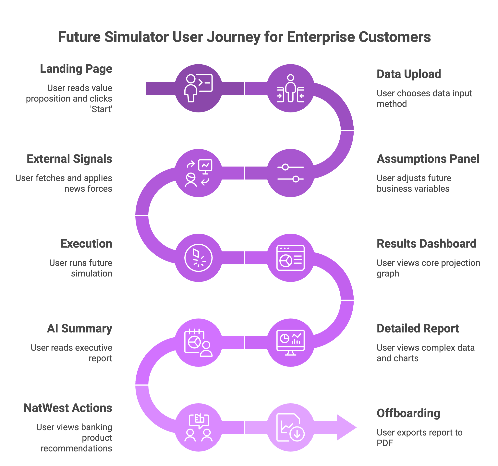

**What this project does:** Future Simulator is a React-based forecasting dashboard for exploring short-term business scenarios. It helps a user upload operating data, adjust a set of business assumptions, and generate a six-week forecast with confidence ranges, anomaly detection, and a concise AI-assisted summary.

**What problem it solves:** The project solves a common decision-making problem: many small businesses and finance teams have historical data, but they do not have a simple interface for testing "what happens next" under changing growth, cost, staffing, FX, or supply conditions. This application turns that data into an interactive scenario model and presents the output in a readable dashboard instead of requiring spreadsheet-heavy manual analysis.

**Who the intended users are:** This project is aimed at hackathon judges, product reviewers, and SME-focused banking or finance teams who need a fast way to understand how operational changes and external signals could affect near-term performance.

## Features

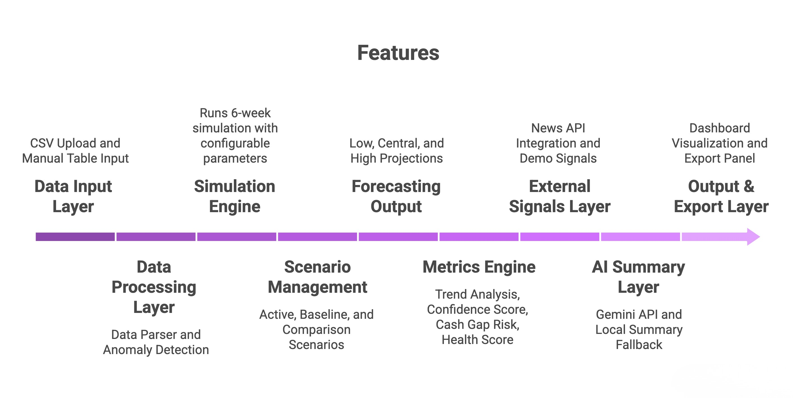

## Tech Stack

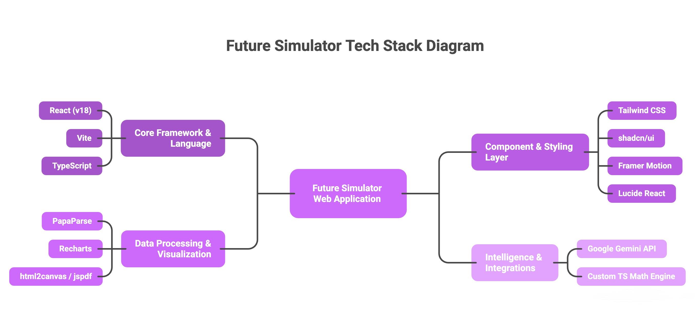

## Usage Examples

Below is a sequential visual walkthrough of how to use the dashboard once it is running:


### 1. Landing Page
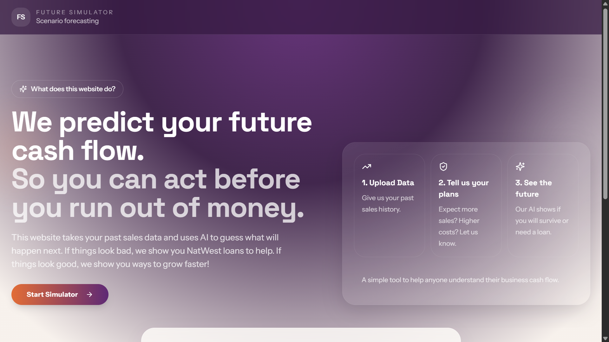

### 2. Upload Historical Data
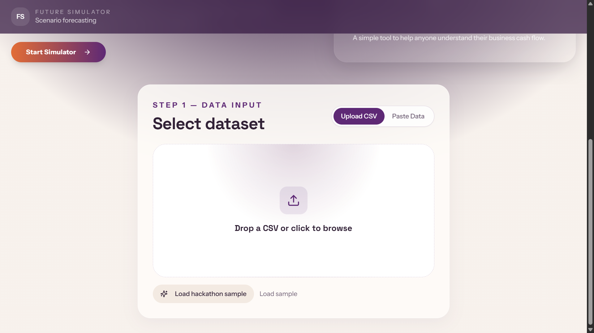

### 3. Adjust Scenarios & Business Variables
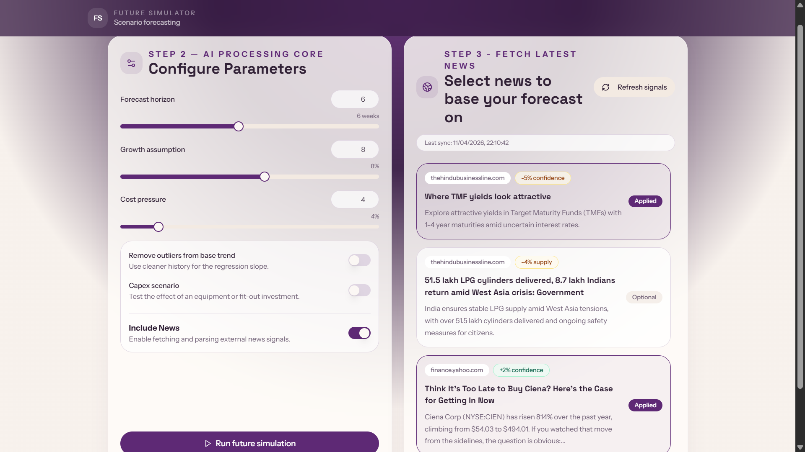

### 4. Six-Week Forecast Visualization


### 5. Detailed Metric Breakdowns
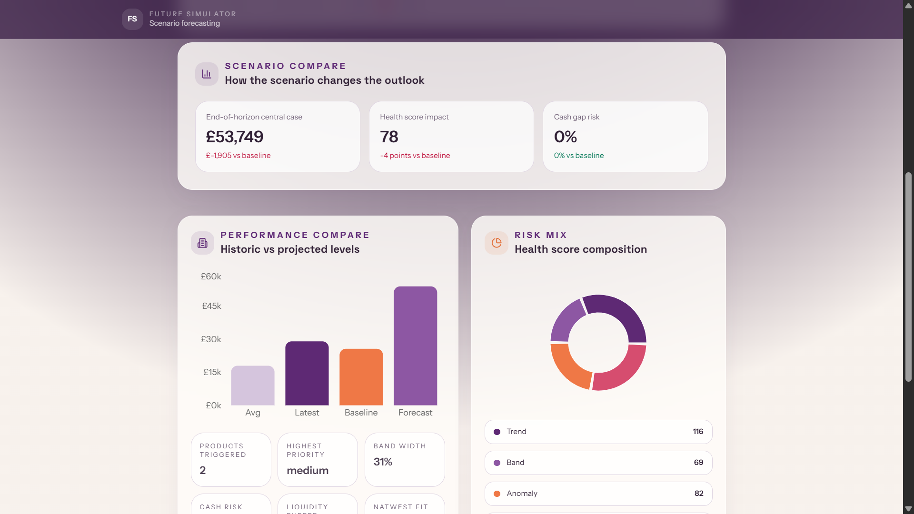

### 6. AI-Assisted Executive Summary
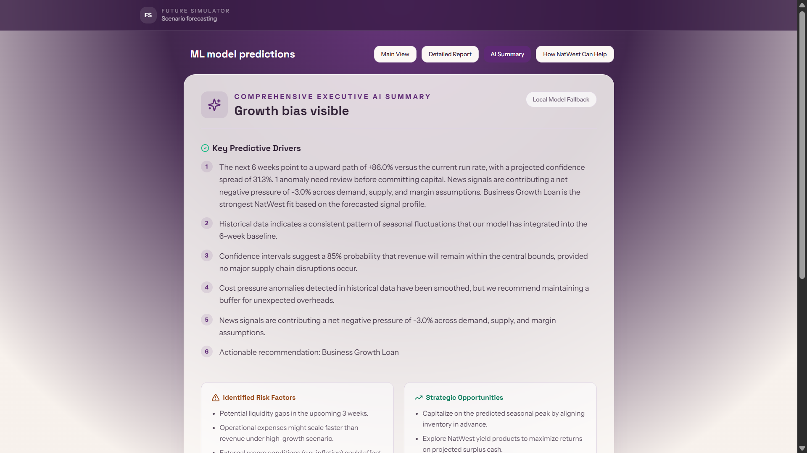

### 7. NatWest Intelligent Triggers
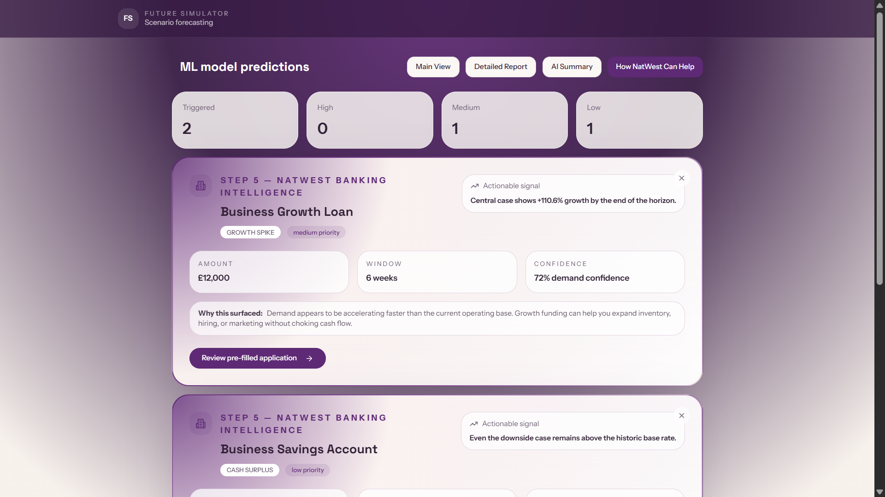

### 8. Document Generation & Export
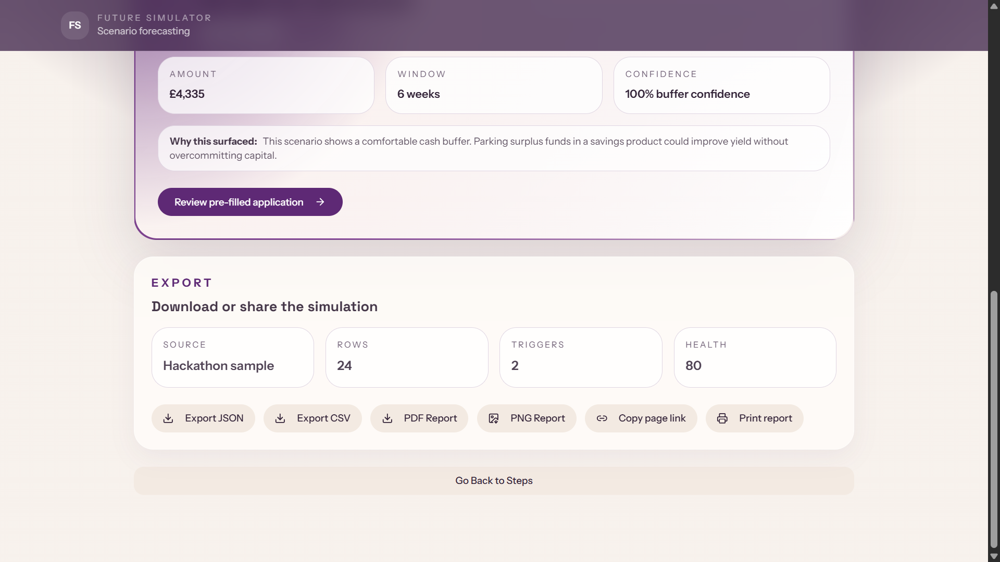

## Project Structure

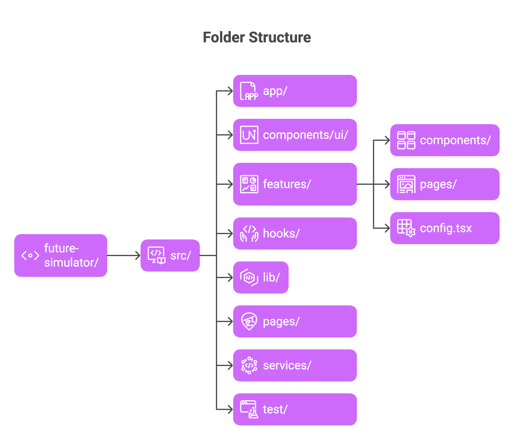

### Folder Notes

- `src/app` contains the application shell and route wiring.
- `src/features/dashboard` contains the main forecasting feature, page layout, and domain-specific UI components.
- `src/components/ui` contains shared UI primitives from shadcn/ui.
- `src/lib` contains simulation logic, sample data, and utilities.
- `src/services` contains external API integrations.
- `src/test` contains the current test setup.

## Architecture Notes

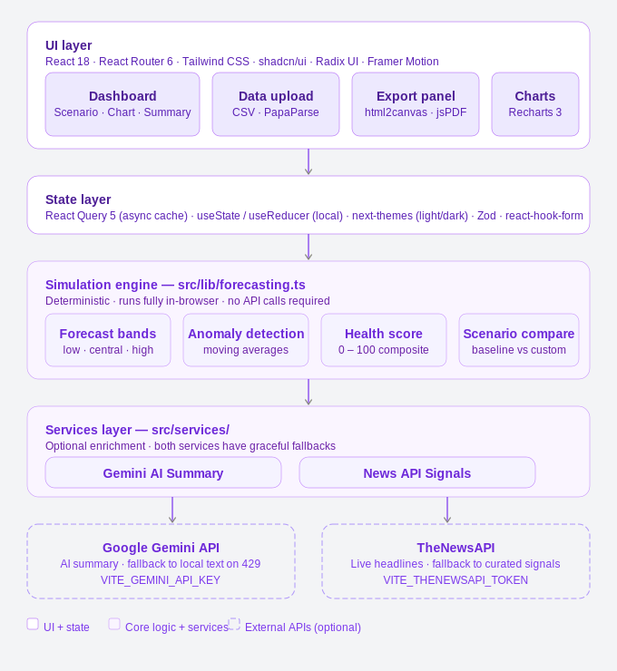

This project is currently a frontend-only application.

### Data Flow

1. The user uploads or pastes time-series business data.
2. The app parses and validates the dataset.
3. The forecasting engine generates:
   - baseline metrics
   - scenario forecast bands
   - anomaly detection
   - derived risk and health metrics
4. Optional external integrations enrich the result:
   - Gemini for summary text
   - live news provider for signal weighting
5. The dashboard renders the output and allows export actions.

### Why This Structure Was Used

- Keeping the simulation engine in `src/lib` makes the business logic reusable and separate from UI rendering.
- Grouping dashboard-specific files under `src/features/dashboard` reduces clutter and makes the main feature easier to navigate.
- Wrapping API integrations in `src/services` keeps provider-specific request logic out of components.

## Tests

Vitest is configured in the project, and the repository contains a test setup directory:

- `src/test/setup.ts`
- `src/test/example.test.ts`

Current status:

- test tooling is present
- test coverage is minimal

To run tests:

```powershell
cmd /c npm run test
```

## Limitations

- The app is currently frontend-only, meaning API keys are passed directly to client-side bundles.
- Live news is dependent on The News API uptime, and Gemini logic defaults to a deterministic summary if heavily rate-limited.
- Simulation logic relies on predictive heuristics suited solely for prototyping, not validated financial models.

## Future Improvements

- Proxy live LLM and News integrations via a serverless secure backend.
- Advance live-news categorization with stricter source quality filtering and relevance scoring.
- Add user-persistent sessions so generated forecast scenarios can be saved, linked, and re-downloaded later.

## Advanced / Technical Depth

The project combines deterministic scenario simulation with optional AI-assisted summarization.

- The forecasting layer uses time-series heuristics, moving averages, anomaly detection, volatility estimation, and scenario-based adjustments to generate a low/central/high projection range.
- Gemini is used only as an explanation layer, not as the core forecasting engine. This keeps the business logic deterministic and inspectable while still providing a faster user-facing interpretation of the results.
- External news signals are transformed into categorized business pressure signals such as demand, supply, FX, and cost. Those signals then influence the scenario model rather than being displayed as raw headlines alone.

This approach was chosen because it balances transparency and demo usefulness:

- deterministic logic keeps the output explainable
- AI adds readable summaries
- external signals make the simulation feel closer to real decision conditions


## Install And Run Instructions

### Prerequisites

- Node.js 18+ recommended
- npm

### 1. Clone the repository

```bash
git clone https://github.com/aggarwal-saksham/future-simulator.git
cd future-simulator
```

### 2. Install dependencies

If PowerShell blocks `npm.ps1`, use `cmd /c`:

```powershell
cmd /c npm install
```

### 3. Create your environment file

Copy the example file:

```powershell
Copy-Item .env.example .env
```

Then update `.env` with your own keys:

```env
VITE_GEMINI_API_KEY=your_gemini_key
VITE_THENEWSAPI_TOKEN=your_thenewsapi_token
```

### 4. Start the development server

```powershell
cmd /c npm run dev
```

Vite will print a local URL, typically:

```text
http://localhost:8080
```

### 5. Optional production preview

Build the app:

```powershell
cmd /c npm run build
```

Preview the production build:

```powershell
cmd /c npm run preview
```

## Configuration

### Environment Variables

The project expects the following values in `.env`:

```env
VITE_GEMINI_API_KEY=
VITE_THENEWSAPI_TOKEN=
```
## 👥 Team Byte Busters

### Authors

- **Saksham Aggarwal (Team Leader)**  
  📧 sakshamaggarwal_23it145@dtu.ac.in  
  📧 saksham08035@gmail.com 

- **Saksham Sapra**  
  📧 sakshamsapra_23it147@dtu.ac.in  

